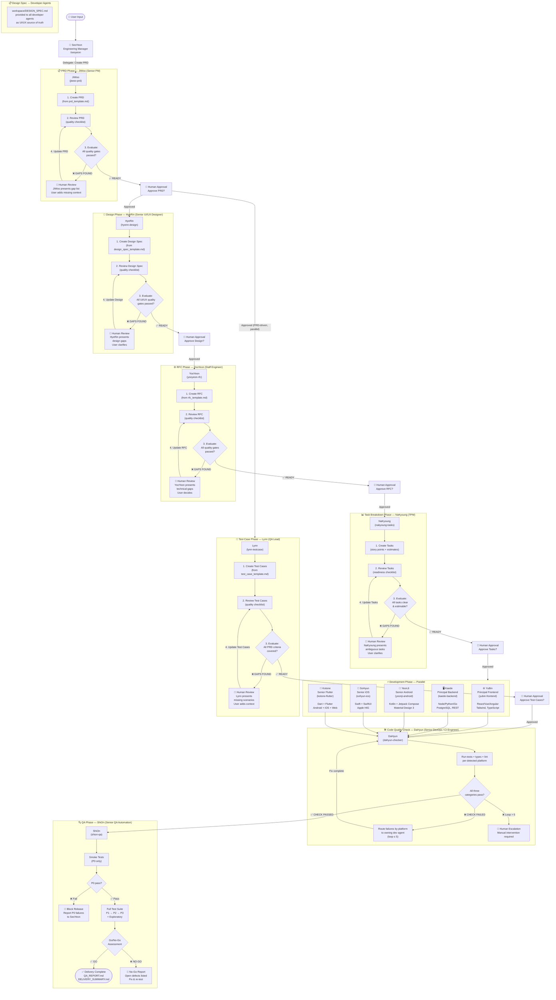
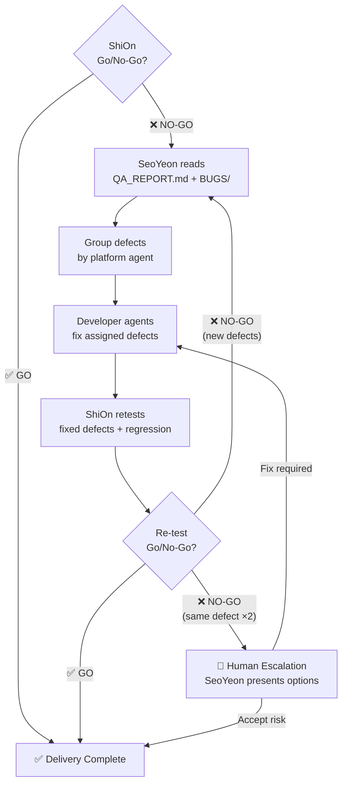

# TripleS Agent Orchestration Workflow

## Agent Roster

| S# | Agent | Persona | Role | Claude invocation |
|----|-------|---------|------|---------------|
| S1 | **SeoYeon** | Engineering Manager | Main Orchestrator | `/seoyeon` (Skill) |
| S3 | **JiWoo** | Senior Product Manager | PRD Agent | `jiwoo-prd` (Agent tool) |
| S2 | **HyeRin** | Senior UI/UX Designer | UI/UX Design | `hyerin-design` (Agent tool) |
| S5 | **YooYeon** | Staff Engineer / Tech Lead | RFC Agent | `yooyeon-rfc` (Agent tool) |
| S7 | **NaKyoung** | Technical Program Manager | Task Breakdown | `nakyoung-tasks` (Agent tool) |
| S8 | **YuBin** | Principal Frontend Engineer | Frontend Web Dev | `yubin-frontend` (Agent tool) |
| S9 | **Kaede** | Principal Backend Engineer | Backend Dev | `kaede-backend` (Agent tool) |
| S12 | **YeonJi** | Senior Android Engineer | Android Native | `yeonji-android` (Agent tool) |
| S14 | **SoHyun** | Senior iOS Engineer | iOS Native | `sohyun-ios` (Agent tool) |
| S11 | **Kotone** | Senior Flutter Engineer | Flutter Dev | `kotone-flutter` (Agent tool) |
| S17 | **Lynn** | QA Lead / Test Lead | Test Case Agent | `lynn-testcase` (Agent tool) |
| S24 | **DaHyun** | Senior DevOps / CI Engineer | Code Quality Check | `dahyun-checker` (Agent tool) |
| S20 | **ShiOn** | Senior QA Automation Engineer | QA Execution | `shion-qa` (Agent tool) |

SeoYeon is the only slash command — the rest are subagents invoked via the Agent tool (Claude Code) or by name (Codex). See [README.md](../README.md#agent-roster) for the full per-platform breakdown.

---

## Full Orchestration Workflow



### Defect Rework Loop (post-QA convergence)



---

## Human-in-the-Loop Gates

Human review is required at five stages. Each gate follows the same pattern:

1. Agent **creates** artifact using its template
2. Agent **reviews** against its quality gate checklist
3. Agent **evaluates**: all gates pass → `READY`; any fail → `GAPS: [numbered list]`
4. Agent returns specific questions; on Codex this is a structured `TRIPLES_USER_INPUT_REQUIRED` payload
5. The interaction owner **presents** it to the human: the specialist on Claude Code, SeoYeon/the parent on Codex
6. Human **provides** clarifications
7. On Codex, the parent re-invokes the owning agent with `TRIPLES_USER_INPUT_RESPONSE`; Claude Code resumes its direct interaction flow
8. Agent **updates** artifact and loops back to step 2
9. Loop exits when `READY`; on Codex the parent owns the explicit approval request, while Claude Code preserves its direct human gate

| Gate | Agent | Artifact |
|------|-------|---------|
| PRD Review | JiWoo (Senior PM) | `workspace/prd/PRD-{slug}.md` |
| Design Review | HyeRin (Senior UI/UX Designer) | `workspace/DESIGN_SPEC.md` |
| RFC Review | YooYeon (Staff Engineer) | `workspace/rfc/RFC-{slug}.md` |
| Task Breakdown Review | NaKyoung (TPM) | `workspace/task-breakdown/TASKS-{slug}.md` |
| Test Case Review | Lynn (QA Lead) | `workspace/test-cases/TC-{slug}-*.md` |

---

## Workspace Artifacts

```
workspace/
├── RUN_STATE.md               ← SeoYeon (resumable run ledger, kept current at every stage transition)
├── prd/PRD-{slug}.md          ← JiWoo
├── DESIGN_SPEC.md             ← HyeRin
├── rfc/RFC-{slug}.md          ← YooYeon
├── task-breakdown/TASKS-{slug}.md ← NaKyoung
├── test-cases/TC-{slug}-*.md  ← Lynn
├── CHECK_REPORT.md            ← DaHyun (tests/types/lint, overwritten on recheck)
├── BUGS/
│   └── BUG-[ID].md           ← ShiOn (one per defect)
├── QA_REPORT.md               ← ShiOn
└── DELIVERY_SUMMARY.md        ← SeoYeon
```

---

## Cross-Platform Handoff Contract

TripleS can run in Claude Code or OpenAI Codex. SeoYeon should hand off work using both platform forms so a user can continue in either assistant:

```text
Next agent: JiWoo PRD
Claude: invoke the `jiwoo-prd` subagent (Agent tool)
Codex: ask Codex to spawn the `jiwoo-prd` agent
Input artifacts: workspace/prd/PRD-{slug}.md
Task: Review and revise until READY.
Open decisions: none
```

Use artifact paths as the source of truth. Do not rely on hidden conversation memory between tools.

### Codex human-input relay

Natural `$seoyeon <request>` is the default Codex entry for document work.
SeoYeon reads `workspace/RUN_STATE.md`, re-presents its oldest pending planning
item, resumes its in-progress document owner, or infers PRD, Design, RFC, Task
Breakdown, or Test Cases from the request. Explicit `run` and `resume` commands
remain compatibility aliases.

The five document subagents inherit the parent task's tool surface and do not own
the user conversation. When JiWoo, HyeRin, YooYeon, NaKyoung, or Lynn needs
clarification or escalation, the agent returns at most three questions between
`TRIPLES_USER_INPUT_REQUIRED` and `TRIPLES_END_USER_INPUT_REQUIRED`, then stops.
SeoYeon or the invoking parent:

1. Reads the ledger, then requires Codex Plan mode before a document mutation,
   document delegation, or direct call to one of those five agents. If
   `request_user_input` is unavailable, it preserves state and asks the user to
   select Plan mode and resend the same natural `$seoyeon` request.
2. Validates that each question has two or three mutually exclusive options and
   exactly one recommendation. The UI's built-in free-form choice handles custom
   answers.
3. Gives the same child one corrective retry for a malformed payload. A second
   malformed response is recorded as `protocol_error` and remains blocked.
4. Records the valid request ID, owner, stage, artifact paths, status, resume
   action, and validation-attempt count in `workspace/RUN_STATE.md`.
5. Uses `request_user_input` without a timeout or automatic resolution. If the
   tool fails after persistence, it retains the pending request and requires the
   natural request to be resent in Plan mode instead of asking in chat.
6. Refuses to advance on missing, partial, duplicate, unrelated, or malformed
   answers.
7. Re-invokes the owner with the correlated response after all answers exist.

The parent creates approval requests after `READY` with exactly **Approve** and
**Request changes**. A specialist never approves its own artifact or advances
the next stage. Setup, implementation, checker, and QA specialists keep their
standard Codex relay and do not require the document Plan-mode preflight.

---

## Convergence Rules

- Planning stages loop through **Create → Review → Evaluate → Human Review → Revise** until `READY`.
- A run can start mid-pipeline with `/seoyeon run --from design|rfc|tasks|dev` when the upstream artifacts already exist (pre-placed in `workspace/` or attached in the prompt); skipped stages are seeded `[x] — provided` and **all downstream human-approval gates still fire**.
- If a stage agent finds upstream context unclear, it raises numbered open questions for the human instead of guessing; an answer that invalidates an upstream document routes back to that document's owning agent for revision (and re-approval).
- Development starts only after PRD, Design, RFC, and Task Breakdown are approved.
- Each task carries a Parallel Group (wave); developer agents build same-wave, independent tasks concurrently and dependency-chain tasks in wave order.
- Test cases are a PRD-driven parallel track: Lynn starts at PRD approval and runs alongside Design → RFC → Tasks → Development; the RFC adds technical-risk edge cases via an enrichment pass once approved. The Test Cases gate is required before QA, not after Tasks.
- DaHyun's Code Quality Check runs once all developer agents finish and test cases are approved; `CHECK FAILED` routes back to the owning developer agent and re-runs, escalating to human after 5 loops.
- QA `NO-GO` routes defects back to owning developer agents, then returns to ShiOn for re-test.
- Human escalation happens after the same planning gate fails 3 times or the same QA defect survives 2 fix attempts.
- Approved artifact changes that affect scope, architecture, design behavior, or release risk require human sign-off.

---

## Quick Start

### Full pipeline — Claude Code
```
/seoyeon run                  → Full pipeline from PRD
/seoyeon run --from rfc        → Start at RFC (attach/place PRD + Design first)
/seoyeon run --from dev        → Start at Development (attach/place Tasks + Design first)
/seoyeon status               → Check current run state
/seoyeon resume               → Continue after a token-limit reset or closed session
```
SeoYeon walks you through the entire workflow, delegating to each agent in sequence. The run ledger at `workspace/RUN_STATE.md` makes long runs resumable. `--from <stage>` accepts `design|rfc|tasks|dev`; downstream human-approval gates are unchanged.

### Full pipeline — OpenAI Codex
```text
Use $seoyeon to orchestrate this feature from PRD through QA with human review gates and a QA rework loop.
```

### Individual agents (Claude Code Agent tool)
SeoYeon delegates to these automatically during `/seoyeon run`, or invoke one directly:
```
jiwoo-prd          [opus]    Start or resume PRD creation
hyerin-design      [opus]    Start or resume UI/UX design spec
yooyeon-rfc        [opus]    Start or resume RFC from PRD
nakyoung-tasks     [opus]    Start or resume task breakdown
yubin-frontend     [sonnet]  Implement frontend web tasks
kaede-backend      [sonnet]  Implement backend tasks
yeonji-android     [sonnet]  Implement Android tasks
sohyun-ios         [sonnet]  Implement iOS tasks
kotone-flutter     [sonnet]  Implement Flutter tasks
lynn-testcase      [opus]    Start or resume test case creation
dahyun-checker     [sonnet]  Run tests, type checks, and lint; report failures by platform
shion-qa           [sonnet]  Execute QA against test cases + dev output
chaewon-init-setup [sonnet]  Explain or audit the local TripleS setup
```
