# TripleS Agent Orchestration Workflow

## Agent Roster

| S# | Agent | Persona | Role | Slash Command |
|----|-------|---------|------|---------------|
| S1 | **SeoYeon** | Engineering Manager | Main Orchestrator | `/seoyeon` |
| S3 | **JiWoo** | Senior Product Manager | PRD Agent | `/jiwoo-prd` |
| S2 | **HyeRin** | Senior UI/UX Designer | UI/UX Design | `/hyerin-design` |
| S5 | **YooYeon** | Staff Engineer / Tech Lead | RFC Agent | `/yooyeon-rfc` |
| S7 | **NaKyoung** | Technical Program Manager | Task Breakdown | `/nakyoung-tasks` |
| S8 | **YuBin** | Principal Frontend Engineer | Frontend Web Dev | `/yubin-frontend` |
| S9 | **Kaede** | Principal Backend Engineer | Backend Dev | `/kaede-backend` |
| S12 | **YeonJi** | Senior Android Engineer | Android Native | `/yeonji-android` |
| S14 | **SoHyun** | Senior iOS Engineer | iOS Native | `/sohyun-ios` |
| S11 | **Kotone** | Senior Flutter Engineer | Flutter Dev | `/kotone-flutter` |
| S17 | **Lynn** | QA Lead / Test Lead | Test Case Agent | `/lynn-testcase` |
| S20 | **ShiOn** | Senior QA Automation Engineer | QA Execution | `/shion-qa` |

---

## Full Orchestration Workflow

```mermaid
flowchart TD
    User([👤 User Input]) --> SeoYeon

    SeoYeon["🎯 SeoYeon\nEngineering Manager\n/seoyeon"]

    SeoYeon -->|"Delegate: Create PRD"| JiWoo

    subgraph PRD_LOOP["📋 PRD Phase — JiWoo (Senior PM)"]
        JiWoo["JiWoo\n/jiwoo-prd"]
        JiWoo --> PRDCreate["1. Create PRD\n(from prd_template.md)"]
        PRDCreate --> PRDReview["2. Review PRD\n(quality checklist)"]
        PRDReview --> PRDEval{3. Evaluate:\nAll quality gates\npassed?}
        PRDEval -->|"❌ GAPS FOUND"| HumanPRD["🧑 Human Review\nJiWoo presents gap list\nUser adds missing context"]
        HumanPRD -->|"4. Update PRD"| PRDReview
    end

    PRDEval -->|"✅ READY"| YooYeon
    PRDEval -->|"✅ READY"| HyeRin

    subgraph DESIGN_LOOP["🎨 Design Phase — HyeRin (Senior UI/UX Designer)"]
        HyeRin["HyeRin\n/hyerin-design"]
        HyeRin --> DesignCreate["1. Create Design Spec\n(from design_spec_template.md)"]
        DesignCreate --> DesignReview["2. Review Design Spec\n(quality checklist)"]
        DesignReview --> DesignEval{3. Evaluate:\nAll UI/UX quality\ngates passed?}
        DesignEval -->|"❌ GAPS FOUND"| HumanDesign["🧑 Human Review\nHyeRin presents\ndesign gaps\nUser clarifies"]
        HumanDesign -->|"4. Update Design"| DesignReview
    end

    DesignEval -->|"✅ READY"| YooYeon

    subgraph RFC_LOOP["⚙️ RFC Phase — YooYeon (Staff Engineer)"]
        YooYeon["YooYeon\n/yooyeon-rfc"]
        YooYeon --> RFCCreate["1. Create RFC\n(from rfc_template.md)"]
        RFCCreate --> RFCReview["2. Review RFC\n(quality checklist)"]
        RFCReview --> RFCEval{3. Evaluate:\nAll quality gates\npassed?}
        RFCEval -->|"❌ GAPS FOUND"| HumanRFC["🧑 Human Review\nYooYeon presents\ntechnical gaps\nUser decides"]
        HumanRFC -->|"4. Update RFC"| RFCReview
    end

    RFCEval -->|"✅ READY"| NaKyoung

    subgraph TASK_LOOP["📊 Task Breakdown Phase — NaKyoung (TPM)"]
        NaKyoung["NaKyoung\n/nakyoung-tasks"]
        NaKyoung --> TaskCreate["1. Create Tasks\n(story points + estimates)"]
        TaskCreate --> TaskReview["2. Review Tasks\n(readiness checklist)"]
        TaskReview --> TaskEval{3. Evaluate:\nAll tasks clear\n& estimable?}
        TaskEval -->|"❌ GAPS FOUND"| HumanTask["🧑 Human Review\nNaKyoung presents\nambiguous tasks\nUser clarifies"]
        HumanTask -->|"4. Update Tasks"| TaskReview
    end

    TaskEval -->|"✅ READY"| DevPhase
    TaskEval -->|"✅ READY"| TestPhase

    subgraph note ["📋 Design Spec → Developer Agents"]
        DesignNote["workspace/DESIGN_SPEC.md\nprovided to all developer agents\nas UI/UX source of truth"]
    end

    subgraph DevPhase["⚡ Development Phase — Parallel"]
        YuBin["🌐 YuBin\nPrincipal Frontend\n/yubin-frontend\n\nReact/Vue/Angular\nTailwind, TypeScript"]
        Kaede["🖥️ Kaede\nPrincipal Backend\n/kaede-backend\n\nNode/Python/Go\nPostgreSQL, REST"]
        YeonJi["🤖 YeonJi\nSenior Android\n/yeonji-android\n\nKotlin + Jetpack Compose\nMaterial Design 3"]
        SoHyun["🍎 SoHyun\nSenior iOS\n/sohyun-ios\n\nSwift + SwiftUI\nApple HIG"]
        Kotone["🦋 Kotone\nSenior Flutter\n/kotone-flutter\n\nDart + Flutter\nAndroid + iOS + Web"]
    end

    subgraph TestPhase["📝 Test Case Phase — Lynn (QA Lead)"]
        Lynn["Lynn\n/lynn-testcase"]
        Lynn --> TCCreate["1. Create Test Cases\n(from test_case_template.md)"]
        TCCreate --> TCReview["2. Review Test Cases\n(quality checklist)"]
        TCReview --> TCEval{3. Evaluate:\nAll PRD criteria\ncovered?}
        TCEval -->|"❌ GAPS FOUND"| HumanTC["🧑 Human Review\nLynn presents\nmissing scenarios\nUser adds context"]
        HumanTC -->|"4. Update Test Cases"| TCReview
    end

    TCEval -->|"✅ READY"| ShiOn
    YuBin --> ShiOn
    Kaede --> ShiOn
    YeonJi --> ShiOn
    SoHyun --> ShiOn
    Kotone --> ShiOn

    subgraph QA["🔍 QA Phase — ShiOn (Senior QA Automation)"]
        ShiOn["ShiOn\n/shion-qa"]
        ShiOn --> Smoke["Smoke Tests\n(P0 only)"]
        Smoke --> SmokeGate{P0 pass?}
        SmokeGate -->|"❌ Fail"| BlockRelease["🛑 Block Release\nReport P0 failures\nto SeoYeon"]
        SmokeGate -->|"✅ Pass"| FullRun["Full Test Suite\nP1 → P2 → P3\n+ Exploratory"]
        FullRun --> GoNoGo{Go/No-Go\nAssessment}
        GoNoGo -->|"✅ GO"| Done
        GoNoGo -->|"❌ NO-GO"| BlockRelease2["🛑 No-Go Report\nOpen defects listed\nFix & re-test"]
    end

    Done(["✅ Delivery Complete\nQA_REPORT.md\nDELIVERY_SUMMARY.md"])
```



---

## Human-in-the-Loop Gates

Human review is required at four stages. Each gate follows the same pattern:
Human review is required at five stages. Each gate follows the same pattern:

1. Agent **creates** artifact using its template
2. Agent **reviews** against its quality gate checklist
3. Agent **evaluates**: all gates pass → `READY`; any fail → `GAPS: [numbered list]`
4. Agent **presents** gaps to the human with specific questions
5. Human **provides** clarifications
6. Agent **updates** artifact and loops back to step 2
7. Loop exits when `READY`

| Gate | Agent | Artifact |
|------|-------|---------|
| PRD Review | JiWoo (Senior PM) | `workspace/PRD.md` |
| Design Review | HyeRin (Senior UI/UX Designer) | `workspace/DESIGN_SPEC.md` |
| RFC Review | YooYeon (Staff Engineer) | `workspace/RFC.md` |
| Task Breakdown Review | NaKyoung (TPM) | `workspace/TASK_BREAKDOWN.md` |
| Test Case Review | Lynn (QA Lead) | `workspace/TEST_CASES.md` |

---

## Workspace Artifacts

```
workspace/
├── PRD.md                    ← JiWoo
├── DESIGN_SPEC.md            ← HyeRin
├── RFC.md                    ← YooYeon
├── TASK_BREAKDOWN.md         ← NaKyoung
├── TEST_CASES.md             ← Lynn
├── BUGS/
│   └── BUG-[ID].md          ← ShiOn (one per defect)
├── QA_REPORT.md              ← ShiOn
└── DELIVERY_SUMMARY.md       ← SeoYeon
```

---

## Quick Start

### Full pipeline
```
/seoyeon run
```
SeoYeon walks you through the entire workflow, delegating to each agent in sequence.

### Individual agents
```
/jiwoo-prd       → Start or resume PRD creation
/hyerin-design   → Start or resume UI/UX design spec
/hyerin-audit    → Audit feature/system design coverage and gaps
/hyerin-content  → Produce UX writing and microcopy spec
/hyerin-mobile   → Define mobile design-system mapping and platform conventions
/hyerin-mobile-audit → Audit mobile design-system compliance and gaps
/hyerin-platforms → Define cross-platform adaptation guidance
/yooyeon-rfc     → Start or resume RFC from PRD
/nakyoung-tasks  → Start or resume task breakdown
/yubin-frontend  → Implement frontend web tasks
/kaede-backend   → Implement backend tasks
/yeonji-android  → Implement Android tasks
/sohyun-ios      → Implement iOS tasks
/kotone-flutter  → Implement Flutter tasks
/lynn-testcase   → Start or resume test case creation
/shion-qa        → Execute QA against test cases + dev output
/seoyeon status  → Check current run state
```
